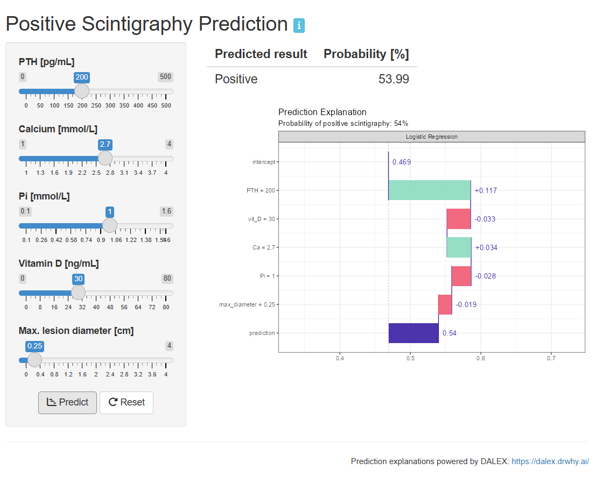

<!-- README.md is generated from README.Rmd. Please edit that file -->

```{r, include = FALSE}
  knitr::opts_chunk$set(
    collapse = TRUE,
    comment = "#>",
    fig.path = "man/figures/README-",
    out.width = "100%"
)
```

# `Positive Scintigraphy Prediction`

<!-- badges: start -->
[](https://lifecycle.r-lib.org/articles/stages.html#experimental)
<!-- badges: end -->

## Overview
This application allows you to calculate predicted probability of a positive
SPECT-CT scintigraphy result based on clinical parameters of patient
provided as inputs. Adjust the patient's parameters on the sliders on the left and click 'Predict' to calculate the predicted probability of positive result. 

```{r echo=FALSE, out.width='70%'}

```

The 'Prediction explanation' graph illustrate how each value contributes to the final prediction result. See https://ema.drwhy.ai/breakDown.html to learn more about this visualisation.

If the patient's lesion couldn't be accurately measured, set  'Max lesion diameter' to 0. Click on 'Reset' to clear the results.

The predictive models are described in:  Drynda, A., Podlewski, J., Kucharczyk, K., Sokołowski, G., Sowa-Staszczak, A., Hubalewska-Dydejczyk, A. and Trofimiuk- Müldner, M., 2025, 'Evaluation of multiple machine learning models predicting the results of hybrid imaging in primary hyperparathyroidism', Nuclear Medicine Review, vol. 28, pp. 47–54, doi:10.5603/nmr.105377

## Run

You can launch the application by running:

```{r, eval = FALSE}
SPECTCTCalculator::run_app()
```
or, in RStudio, opening the app.R file and clicking Run App button.

## About

You are reading the doc about version : `r golem::pkg_version()`

This README has been compiled on

```{r}
Sys.time()
```

